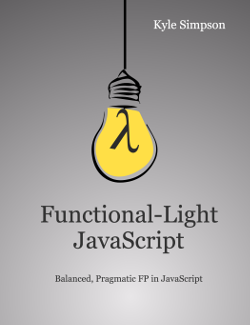

# Functional-Light-JS-zh
轻量函数式 JavaScript 中文

感谢原作！原 repo 地址：[https://github.com/getify/Functional-Light-JS](https://github.com/getify/Functional-Light-JS)

在线阅读：[https://gdut-yy.github.io/module_book/JS/Functional-Light-JS-zh/ch1.html](https://gdut-yy.github.io/module_book/JS/Functional-Light-JS-zh/ch1.html)



## 本地开发 & 阅读

本项目基于 vuepress 进行开发，以提供比 github mardown 更佳的阅读体验，依赖于 `node.js`、`yarn`、`vuepress` 等环境

```sh
# node
node -v
> v10.14.1
# yarn
yarn -v
> 1.13.0
# vuepress
yarn global add vuepress

# 本地开发
git clone https://github.com/gdut-yy/Functional-Light-JS-zh.git
cd Functional-Light-JS-zh
yarn docs:dev

# 本地阅读
http://localhost:8080/
```
